# 连字成词（题目5.14）技术报告

黄泽文 2022013014 未央-软件21班 zw-huang22@mails.tsinghua.edu.cn 18250653067

## 一、项目简介

### 1.项目内容

本项目实现的是一个消消乐类的文字游戏。游戏运行界面如图所示。游戏主界面由8\*8的汉字方格组成，玩家可以通过连接相邻的汉字方格组成成语，将其消除。每个方格右上角的数字提示代表其在成语中是第几个字，方格的边框颜色代表其属于哪个成语。侧栏显示玩家的游戏进度、游戏时间和游戏功能。

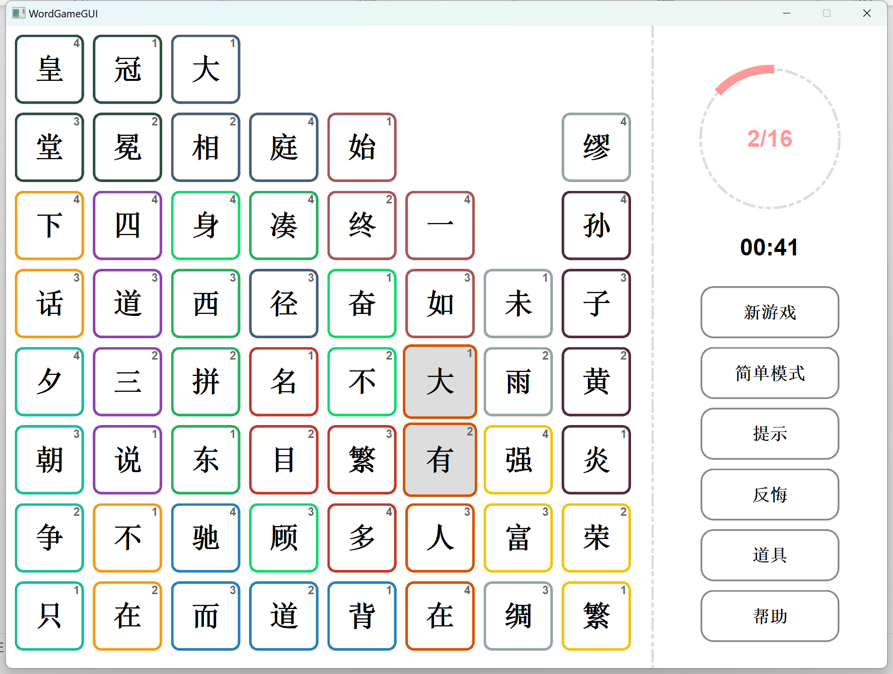

本项目可以分为前后端两个部分。后端主要包含游戏地图的生成算法及游戏过程中的消除、历史记录等功能，前端主要包含游戏界面设计、游戏动画及交互等功能（使用Qt实现）。为了确保完全随机生成的游戏地图在保证有解的前提下尽可能具有较高的可玩性，我实现了效果比较良好的生成算法，这一部分内容也是整个项目中最具挑战性的部分之一，其余的难度则基本在Qt的学习与运用上。

### 2.开发环境

操作系统：Windows 11，64位

IDE：CLion 2022.2

工具链：Qt 6.4.2, mingw 1120_64, cmake 3.24.2

编程语言：C++

编译指令：cmake.exe --build \WordGameGUI\cmake-build-debug --target all -j 9

## 二、后端实现思路

本节主要分为三部分，分别介绍游戏的基本结构、游戏地图的生成算法以及游戏推进过程中的功能接口。

### 1.基本结构

#### （1）元结构体

项目有两种结构体（通过类实现），作为最小的游戏单位：代表组成一个成语的图形的Meta，和代表单个汉字方格的Block。

##### a. Meta

Meta结构体的实现参见Meta.cpp与Meta.h。该结构体*只在地图生成过程中使用*，在游戏过程中没有用途。

Meta结构体记录的是一个成语在其**可以被消除时组成的形状**。具体地讲，每个Meta结构体内有一个4*4的int数组，元素值为0意味着该处没有方格，为非0值意味着该处对应着成语某个字符方格。例如，下图这个“繁荣富强”的方格在Meta结构体中表示为：

```c++
const Meta *F_interHighL = new Meta(2, 3, (int[][4])
        {{4, 0, 0, 0},
         {3, 2, 0, 0},
         {0, 1, 0, 0},
         {0, 0, 0, 0}});
```

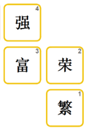


##### b. Block

Block结构体的实现参见Block.cpp与Block.h。该结构体*在游戏过程中使用*。

在游戏地图生成算法给出所需的Meta元素后，需将其转换为可以在游戏中操作的地图。由于游戏中各个方块之间必然会有相对位置变化，因而需要一个以单字方块为最小单位的结构体，Block正是这个最小单位。

每个Block包含parent和index属性，分别代表所属的成语和在成语中是第几个字。通过8*8的Block数组，就可以存储整个游戏地图。

#### （2）基本图形分类

延续上面的Meta结构，这里先对游戏的基本图形做定义与分类。这个游戏颇有一些俄罗斯方块的味道——每个成语由四个方格组成，而这四个方格在能够消去时，其拼成的形状与俄罗斯方块中的方块类似（T字形除外）。

因此我们可以先把这些基本图形罗列并储存，方便后续生成游戏地图。如图所示，我将图形分为了**“有底”**与**“无底”**两类。“无底”的图形中有悬空的方块，在没有其他图形的方格的支撑时，自身的某些方格会向下掉落，导致内部相对位置改变，形状发生变化；一旦无底图形落到地图最底部，则会变得无解。而“有底”的图形没有悬空的方块，因而可以独自稳定存在。

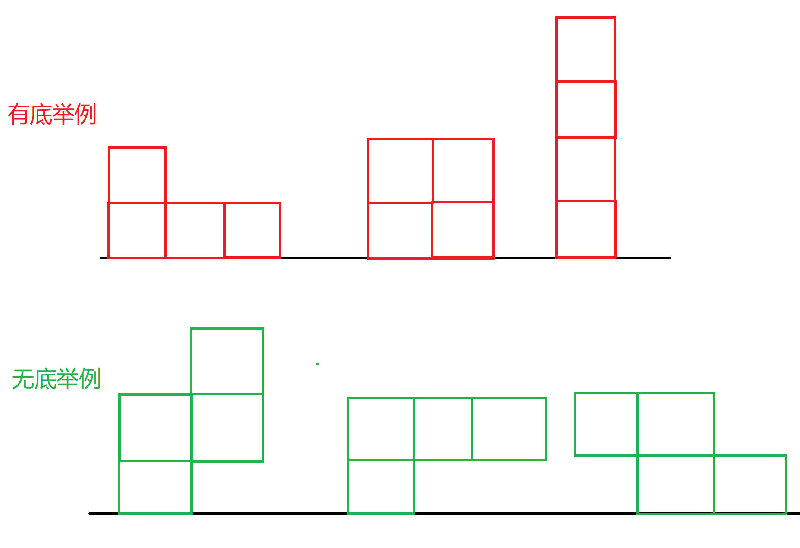

这里涉及到一个问题，尽管无底图形掉落后仍然是联通的，但已经无法被消除了。因为成语四个字的顺序是固定的，所以图形中各个方块的相对位置不能有一点变化，否则就会破坏相邻关系——这也是定义Meta类型的好处：每个成语只可能以一种形状被消除。

基本图形一共有7种有底、8种无底，共15种，参见MetaList.h。

#### （3）GameMap类

GameMap是整个游戏的核心类。其中实现了游戏的生成与交互等核心功能。参见GameMap.cpp与GameMap.h。

### 2.地图生成算法

#### （1）基本思路

##### a.核心思路：逆向生成

因为生成的地图至少要有一种解法，所以一个很自然的思路就是**逆向考虑：向一个空地图中，按顺序插入十六个成语图形**，所生成的地图则可以将这个顺序反过来作为解法。

因为方块会受重力下落，所以可以把部分已有的方块向上挪动，腾出四个格子的空间插入新的图形，这个操作是可逆的；但为了保证插入的新图形在逆向操作的时候可以被消除，该图形不能是部分悬空的，否则自身因重力下落后将可能变得无法消除，那么这个操作就不可逆了。如下图所示，直接把“屡见不鲜”放在最上方，将导致他的形状发生变化，变得无法消除，也就无法实现必定有解的目标。

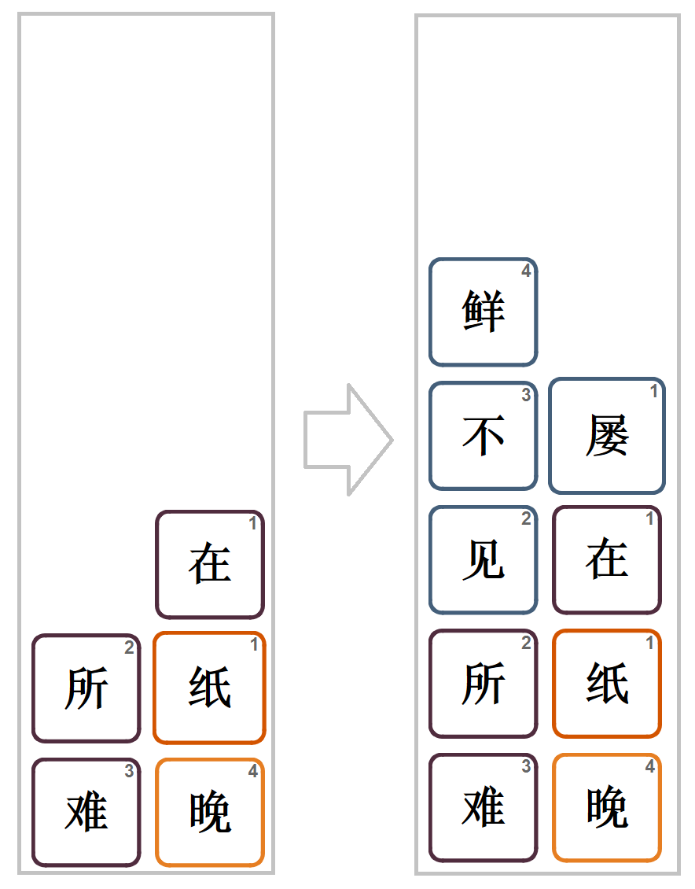

我们可以把上面的思考总结成一个易于实现的操作：（a）**每次都将新的图形插入到已有图形中间**，而不是将其直接摞到原有的图形上面。这个操作方法的另一个好处就是，它可以将先前的图形充分打乱，提高游戏的难度。如图所示，插入的新成语“一天到晚”打乱了“有恃无恐”等其他图形，但保持住了自身的形状。

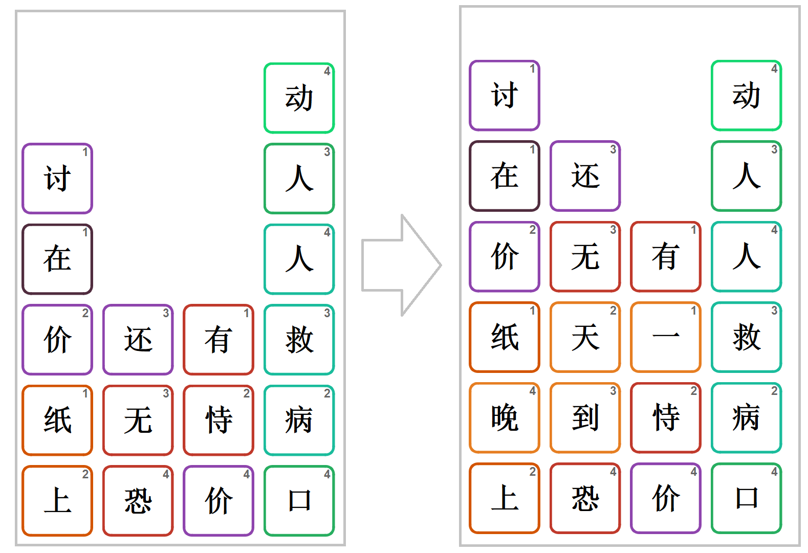

##### b.初始条件设置

接着考虑初始条件。在刚开始生成时，地图中还没有方块，或已有的方块还太少，无法实现把新图形“插入到已有图形中”的操作。为此，我们需特殊处理这个边界条件。

具体地说，在初始的空地图中，我们需要先（b）**放置一层*有底*的图形**，将其铺在整个地图下方，确保每一列都有至少一到两个方块。接着便可以开始上述的插入新图形操作了。如图例，先放置一层有底图形“令人咂舌”“切身体会”“奄奄一息”在底部，由于他们都是有底图形，所以不会受重力变形；接着便可依次插入“如出一辙”“皆大欢喜”“混为一谈”等图形了。

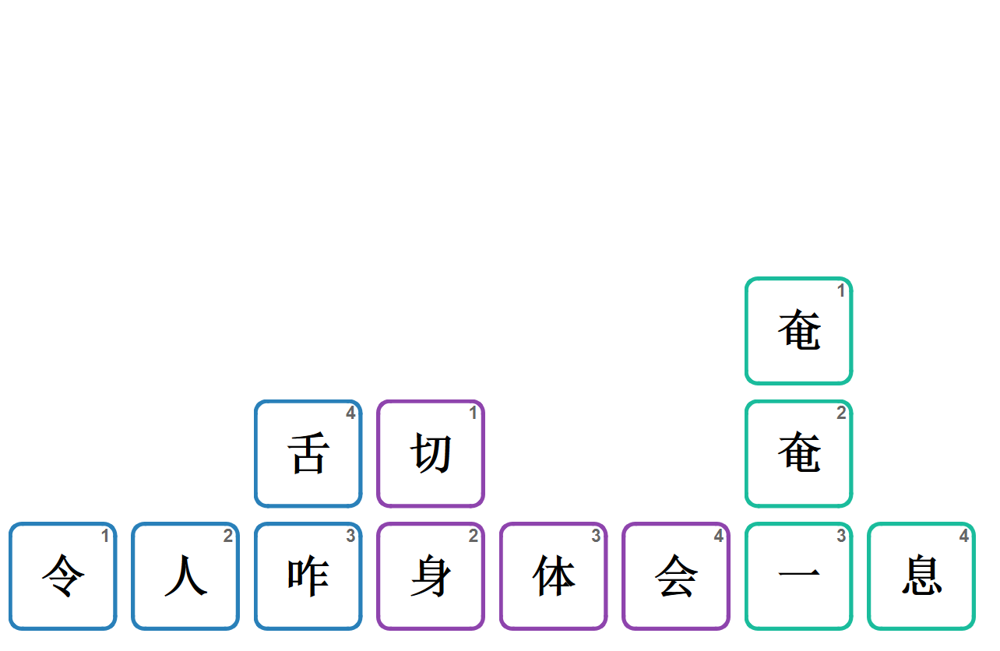

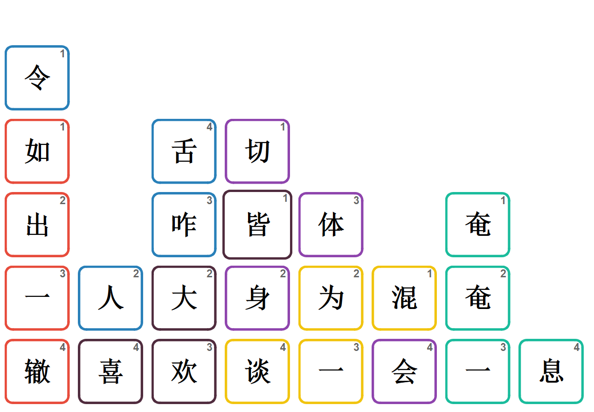

##### c.预先确定每列所选图形

最后，还要考虑到，由于地图每一列的高度限定为8，而随便摞图形并不能确保刚好把每一列填满且不超出，所以在开始填充地图之前，应该提前就（c）**确定每一列选择使用的图形类型和个数**（这里不妨用每个图形最左边的一列的横坐标代表整个图形所在的列），然后按照确定的图形列表依次将其插入地图中。注意，此时考虑的是图形所在的列，暂不考虑其在地图中的高度——各个方块所处的高度是在插入时才决定的。


依照“（b）放置一层有底的图形→（c）确定每一列选择使用的图形类型和个数→（a）依次都将新的图形插入到已有的图形中间”的顺序实现功能，即可完成地图生成。

生成完地图图形后，向其中随机填入成语即可。我使用了“[THUOCL：清华大学开放中文词库 (thunlp.org)](http://thuocl.thunlp.org/)”的开源成语词库，截取了其中词频比较高的部分，参见idiom.h文件。

#### （2）理论验证与实现

地图的生成代码参见GameMap.cpp与GameMap.h，调用GameMap::generate()函数即可随机构造一个新的地图，上一小节所提到的三个生成环节在代码中有注释说明。

首尾两个环节（预先放置一层图形和插入第二环节所确定的图形）实现并不困难，这里**主要探讨第二环节的实现方法，即如何构造确定每一列所使用的图形类型和个数**。下文分为代数方法和dfs方法进行讨论，我在项目中使用的是第二种方法。

##### a.代数方法

设$x_i,_a$为第$a$列使用第$i$种Meta图形的个数$(0 \leq a < 8)$，$t_i,_b$为第$i$个Meta图形自身的第$b$列的方块个数($0 \leq b < width_i \leq 4$；方便起见假设每个图形都有4列，当$b \geq width_i$时，$t_i,_b=0$)，$base_a$为第$a$列在第一环节中放置的方块个数。不难列出以下方程组：
$$
\sum_{i}x_i,_0t_i,_0 = 8 - base_0\\
\sum_{i}x_i,_1t_i,_0 + x_i,_0t_i,_1 = 8 - base_1\\
\sum_{i}x_i,_2t_i,_0 + x_i,_1t_i,_1 + x_i,_0t_i,_2 = 8 - base_2\\
\sum_{i}x_i,_3t_i,_0 + x_i,_2t_i,_1 + x_i,_1t_i,_2 + x_i,_0t_i,_3 = 8 - base_3\\
...\\
\sum_{i}x_i,_7t_i,_0 + x_i,_6t_i,_1 + x_i,_5t_i,_2 + x_i,_4t_i,_3 = 8 - base_7\\\\
\sum_{i}x_i,_7t_i,_1 + x_i,_6t_i,_2 + x_i,_5t_i,_3 = 0\\
\sum_{i}x_i,_7t_i,_2 + x_i,_6t_i,_3 = 0\\
\sum_{i}x_i,_7t_i,_3 = 0
$$
前8个方程限制每列有八个方格，后3个方程限制没有超出地图右侧的方格。

已知有15种Meta图形（参见MetaLish.h），故方程组至多有$15*8 = 120$个元，系数则是一个带状矩阵，求其一组非负整数解即可。由于$t_i,_b$是已知值，可以对其做预处理方便计算。但因为自由变量数量巨大，而解又限制为非负整数，所以这个方法还需要很多的细节处理，实现起来并不方便。

##### b.dfs方法

参见GameMap::dfs()函数。这种方法的思想很简单，以已经填入的成语图形个数为深度$depth$，到达$depth=16$就完成搜索。对于每次搜索，随机生成一个Meta图形的排列$i_k$和一个选择放置的列的排列$a_k$ $(a_k+width_i \leq 8)$，按排列顺序依次尝试将第$i$个图形放置在第$a$列（这里的放置并不考虑图形内部方块的相对位置变化，可以想象成在重力影响下直接往第$a,a+1...$列上摞，只要放得下即可）。如果放置成功就搜索下一层；如果放置失败或下一层搜索找不到合法解则回溯，继续尝试下一组$i$和$a$。

从效率的角度考虑，这种生成方法并不理想。设每次搜索的复杂度为$s$，则最坏情况下，$n$个Meta图形在$w*w$的地图中可能达到$O((wn)^{w^2/4}s)$的惊人复杂度，也就是$120^{16}s$次运算。

然而，尽管最坏复杂度是指数的，但在大多数情况下，算法依然能够正常运行。分析极少数不能在正常时间内生成的原因，一般是在深度为6~10层左右时构造了一个无解的情况（更浅时，出现无解的概率并不大；更深时，很快就会回溯），导致后面几层不断在重复无解的尝试。这种特殊情况可以通过剪枝处理一部分，在每次搜索时计算各个空白联通区域的面积，如果面积不是4的倍数，则必然不会有解，可以直接回溯。

但剪枝之后依然可能出现少数异常情况，最终我利用指数增长的性质，解决了这个问题。大多数生成都能在很少的搜索次数（如100次）内就完成；一旦搜索到达了这个次数还没有得到结果，那么将有很大概率需要非常大的次数（如$10^9$次）才能完成，导致明显卡顿。因而，可以在搜索中进行计数，**一旦发现搜索进行了一定次数（这个次数不必设得很大）还没有得出结果，就截断搜索，强行回溯到第4~6层左右（假设前3层是第一环节放置的图形）再次搜索**。在实际试验当中，这种方法的效果很不错。尝试调整修改截断次数$t_{max}$与回溯层数$depth_{re}$，生成100张地图,计算*平均进行截断的次数和平均搜索总次数*，实验结果如下表所示。

| $t_{max}$\\$depth_{re}$ |     4      |     5      |       6        |
| :---------------------: | :--------: | :--------: | :------------: |
|           50            | 5.71/285.5 | 7.31/365.5 | 298.55/14927.5 |
|           100           |  4.48/448  |  5.26/526  |   63.9/6390    |
|          1000           | 2.89/2890  | 5.69/5690  |  16.14/16140   |

可以比较明显看出，平均截断次数随$t_{max}$单调减，随$depth_{re}$单调增；平均搜索总次数随$t_{max}$与$depth_{re}$单调增；$t_{max}$对效率的影响并不大，而$depth_{re}$的影响是指数的。这符合我们的理论分析。根据实际体验情况，只要最大搜索次数在5000次以内，就不会感受到卡顿，为此平均搜索次数最好能控制在1000次以内。在此范围内，则可随意选择两个参数。最终将参数定为$t_{max}=100$，$depth_{re}=5$。

如此，我们便将这个搜索算法的耗时控制在了可以接受的范围内，而完全随机选取的方法也保证了最终地图生成的多样性。

### 3.游戏功能

GameMap类还实现了以下功能：

- printMap()/printID()：输出地图
- removeable()/updateTip()：判断一个成语图形当前可否消除，以及当前有哪些成语图形可消除
- rmMeta()：消除一个图形，更新状态
- (stack)historyMap/revoke()：记录历史操作，存储在一个栈中；可以撤销先前操作
- 其他量的查询与修改操作

## 三、前端实现思路

代码的前端使用Qt框架实现，参见MainWindow.cpp与MainWindow.h。这里我主要参考了Qt官方文档(https://doc.qt.io/)，也在调试错误时浏览了一些零碎的论坛博客的解决方案。

### 1.界面设计

游戏界面分为左右两部分，左边是主要游戏界面，右边是信息栏和操作按钮。

左侧的方格对象buttons\[i\]\[j\]的类型是继承自QLabel的类MetaButton，通过QPainter在右上角绘制了一个小数字，代表其在成语中是第几个字；其样式通过QSS进行定义。尽管排列方式符合QGridLayout的应用场景，但后者无法满足方块下落的更新需求，因而代码中并没有使用QGridLayout，而是通过geometry值进行绝对定位。（使用geometry值，也使得下一节中的交互动画能够正常实现）

右侧上方的进度动画通过QPainter绘制（参见MainWindow::paintEvent），绘制一个完整的圆和一个圆弧；需注意Qt中的单位角度是$1/16$度，所以在设置角度数值时需要乘16。计时器通过QTimer实现。

右侧操作按钮提供了常规的“新游戏”“帮助”等按钮，也实现了“简单/困难模式”“提示”“反悔”“道具”等比较特殊的功能，具体将在第3小节进行介绍。

### 2.交互动画

游戏的主要动画有两部分：在鼠标划过与拖动时的放大动画和消除后的下落动画。这两部分动画都是通过QPropertyAnimation实现的。

放大和复原的动画参见MainWindow::loadAnimationExpand()与MainWindow::loadAnimationShrink()，而触发器和判定代码参见MainWindow::eventFilter()。利用QPropertyAnimation，只要设置始末关键帧的geometry值就可以自动生成动画，代码参考如下。实现中需要注意的是，鼠标滑动动画可能随时被打断，为了避免动画中途打断导致按钮尺寸错误，应将初始关键帧设为当前状态，末尾关键帧设为**固定的绝对尺寸大小（而非相对当前状态的大小）**。

```c++
void MainWindow::loadAnimationShrink(int i, int j) {
    if (animationButton[i][j] == nullptr)
        initButtonRect[i][j] = buttons[i][j]->geometry();
    animationButton[i][j] = new QPropertyAnimation(buttons[i][j], "geometry");
    animationButton[i][j]->setDuration(50);
    animationButton[i][j]->setStartValue(buttons[i][j]->geometry());
    animationButton[i][j]->setEndValue(initButtonRect[i][j]);
    animationButton[i][j]->start();
}
```

掉落的动画在MainWindow::clearWord()中与消除词语的代码一并实现。我们首先可以发现，在消除一个成语时，**每一列中被消除的方块一定都是相邻的**，这是由于面积为4的联通图形在方格中必定是不凹的。因而在每一列中，被消除的方块将整列分为两部分，在其上方的都会**下落相同的高度**，在其下方的不会受影响。只要计算出每一列开始下降的方格高度和下降的总高度，即可通过QPropertyAnimation修改其pos值了。为了避免鼠标停留在掉落的方块上触发放大动画导致下落中断，应在调用放大动画的判定中增加对于下落状态的判断。

### 3.功能实现与前后端交互

#### （1）基本功能

以下是MainWindow类中涉及游戏功能的关键函数。

- loadNewGame()：生成新的GameMap对象，重设游戏参数。
- clearWord()：接收到一个消除操作后，向GameMap调用rmMeta()更新地图，同时刷新界面上的按钮指针、坐标，并显示掉落动画。这里的刷新利用到了前文提及的“每一列中被消除的方块一定相邻”的结论。
- syncToMap()：从GameMap重新同步地图，根据GameMap::mapBlock\[\]\[\]中的元素重新生成界面上的方块元素。在正常消除过程中，不调用该函数（clearWord()已经能够确保前后端数据相同）；但在开始新游戏、切换难度、反悔、使用道具时，需要调用这一函数，确保画面正确，前后端一致。

#### （2）特殊功能

这部分的功能参见BarButton类，BarButton在被按下后通过父窗口指针完成操作。

- 难度切换：游戏设置了简单模式（方块边框有颜色提示）和困难模式（所有方块的边框都是灰色）。若要切换，调用syncToMap()修改QSS并重新绘制即可。
- 提示：调用GameMap::(vector)tipList查询目前有哪些成语图形可以消除，修改对应方格的字体。
- 反悔：调用GameMap::revoke()，在后端执行反悔操作，再调用syncToMap()同步到界面上。
- 道具：使用道具后，只要单击一个格子，就可以无视相邻的要求，直接消除其对应的成语的四个格子。打开道具功能后，交互动画改变，悬停在一个格子上时，同时放大该成语的另外三个格子。单击，调用gameMap::rmMeta()消除这个成语。需要注意的是，由于使用道具时，同一列中被消除的格子可能并不相邻，所以clearWord()函数无法正确刷新，掉落动画也无法正常播放，需使用syncToMap()函数重新同步。

## 四、运行效果

选取：

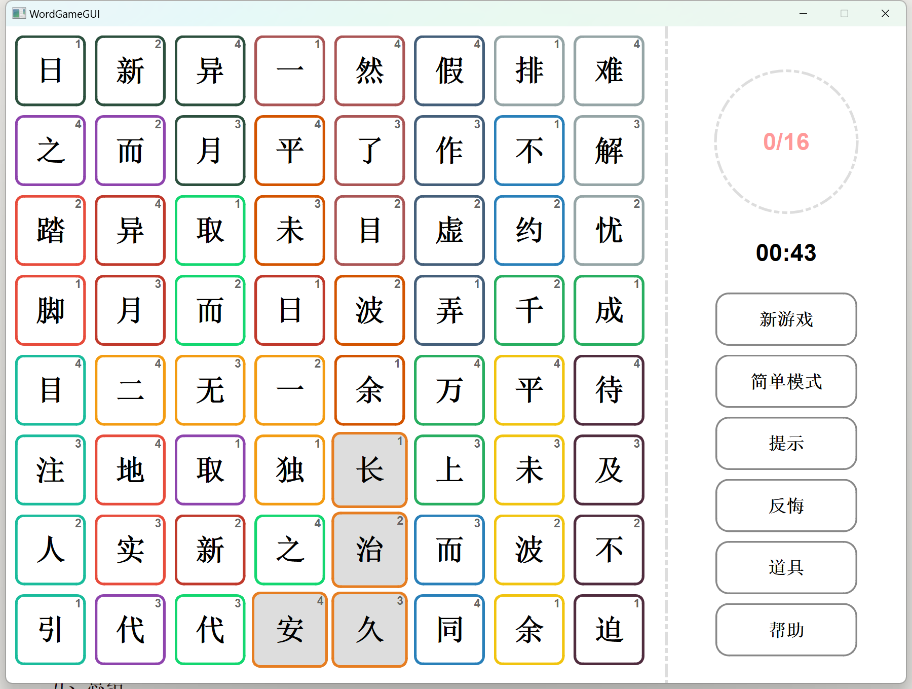

掉落瞬间：

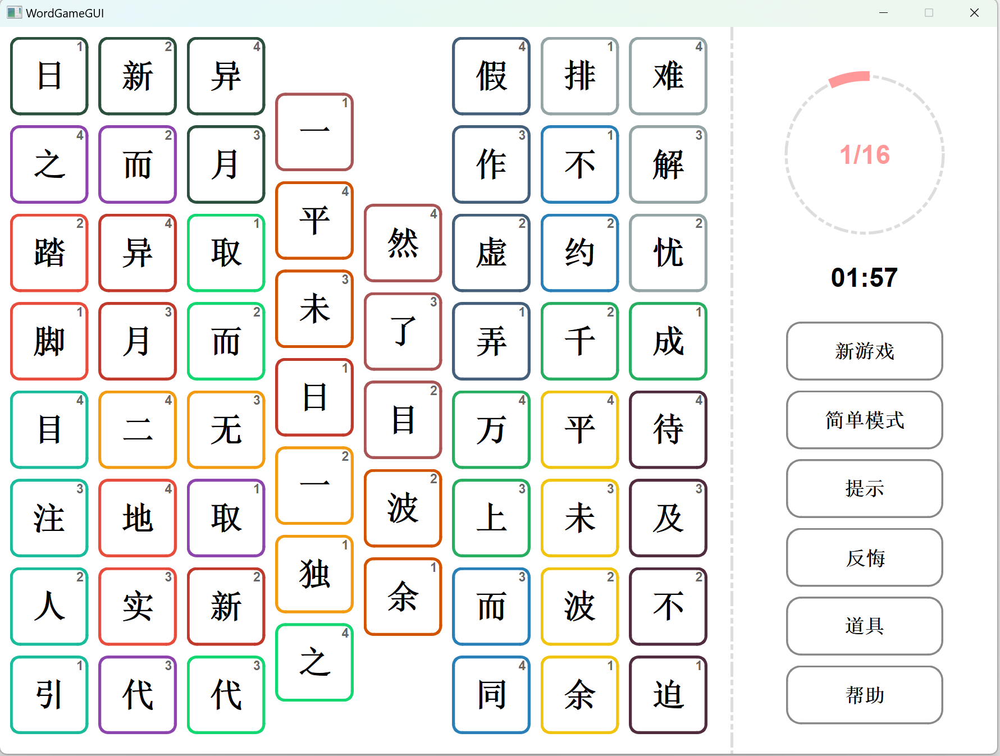

困难模式：

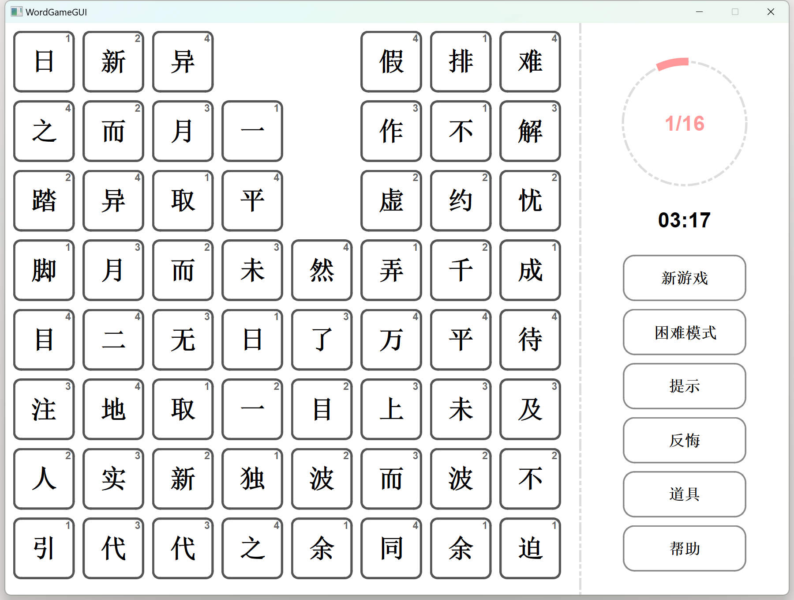

打开提示（可消除的方格变为黑体字）：

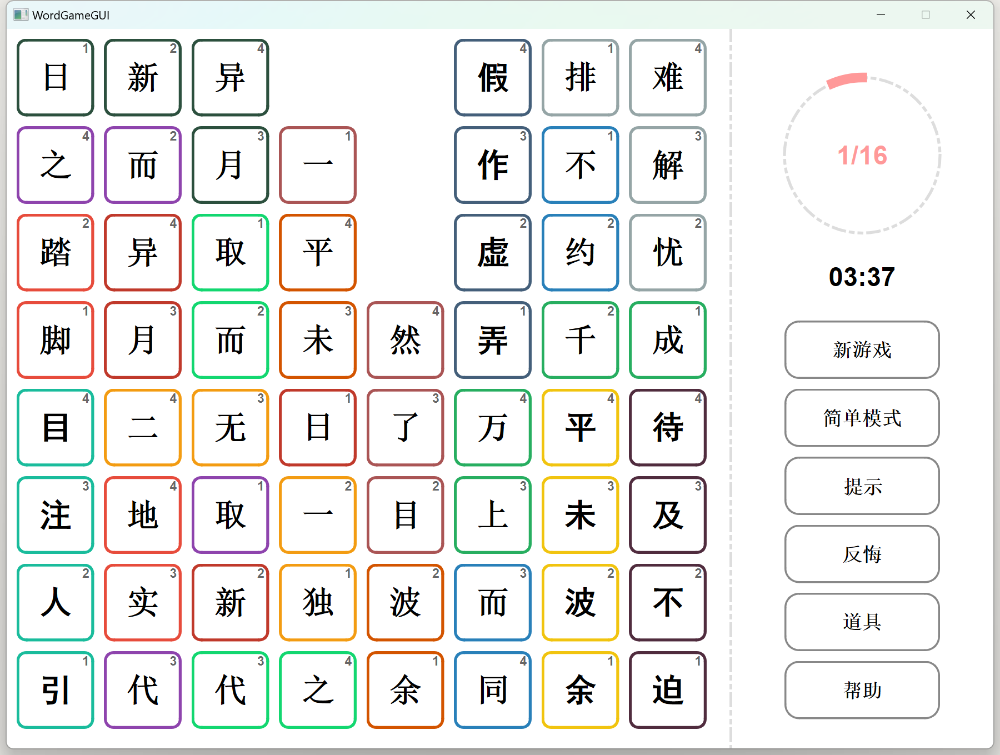

打开道具（鼠标悬停的格子对应的成语全部变为楷体放大，如图中“取而代之”所示）：

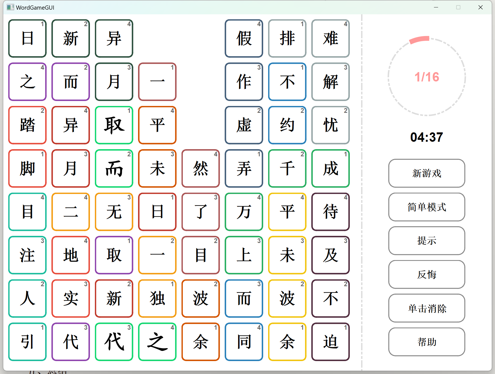

## 五、总结

本项目使用了C++和Qt 6进行开发，在后端实现了比较完整的游戏模型和算法，在前端实现了观感效果比较良好的交互界面与动画效果。经过这个项目的训练，我设计模型解决问题的能力和使用Qt进行图形界面开发的能力得到了提升。在前期选择报告主题时，尽管该题在选题列表中仅被定义为中等难度，但我预想本题在实现上对逻辑能力的考察与锻炼会比较强，故选择了这个选题。在实现过程中，我也的确发现本题有许多值得思考、挖掘之处，完成的难度并不算小。

本项目也有一些遗憾。例如，地图生成的算法虽然运行效果良好，但在原理上并不完美；在前端代码中，我对信号与槽的使用并不熟练，在一些地方使用了更讨巧的实现方法；作为学习面向对象思想的程序，一些代码的写法还有改进之处。此外，囿于篇幅，一些我在该项目中学习的内容和进行的尝试、研究无法详尽介绍：如CMake文件的语法格式、Qt项目的构建打包、用代数方法完成地图生成第二阶段的具体实现、游戏地图多解性的证明等等，这些内容亦给我带来了许多收获。

## 参考资料

1. 朱文伟 Qt 6.x从入门到精通[M]. 北京: 清华大学出版社, 2022.
2. [Qt Documentation | Home](https://doc.qt.io/)
3. [Clion+Qt6开发环境配置_clion qt6_暴躁网友胡汉三！！的博客-CSDN博客](https://blog.csdn.net/qq_46332636/article/details/114380920)
4. [THUOCL：清华大学开放中文词库 (thunlp.org)](http://thuocl.thunlp.org/)
5. [QPropertyAnimation- 淡入淡出并且大小转换同时动画_qt中关于大小的动画_杀猪的大侠的博客-CSDN博客](https://blog.csdn.net/EFM32/article/details/103655601)
6. [Qt之QPropertyAnimation 在动画中改变控件大小时需要注意_Ilson_的博客-CSDN博客](https://blog.csdn.net/Ilson_/article/details/83999783)
7. [Cannot find libgcc_s_seh-1.dll after windeployqt | Qt Forum](https://forum.qt.io/topic/132909/cannot-find-libgcc_s_seh-1-dll-after-windeployqt)


